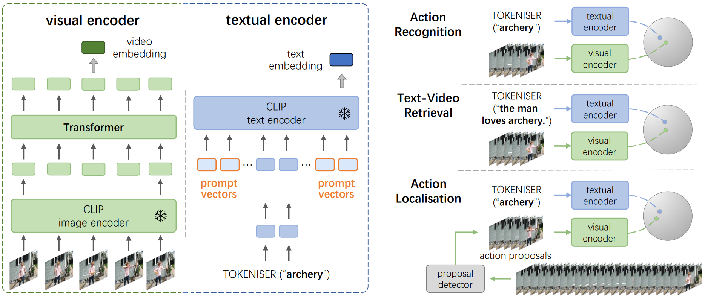

# Prompting Visual-Language Models for Efficient Video Understanding

Chen Ju, Tengda Han, Kunhao Zheng, Ya Zhang, Weidi Xie. ECCV 2022.

[[project page]](https://ju-chen.github.io/efficient-prompt/)
[[Arxiv]](https://arxiv.org/pdf/2112.04478.pdf)
[[Video]](https://ju-chen.github.io/efficient-prompt/)

<center></center>


## Get Started on HMDB51 (More datasets will be available soon)

### Environment
- python >= 3.6.10
- pytorch >= 1.7.1
- tensorboardX
- einops
- tqdm

### Data Preparation
* Download the CLIP pre-trained features of HMDB51 from [here](https://pan.baidu.com/s/1dkXO0-kNf3e7Y6mMdPoIzw?pwd=ob7p&_at_=1657878872095).
  
  Unzip the features, and put them under the *./feat* folder.

* Download the pre-train model of HMDB51 from [here](https://pan.baidu.com/s/1rpPlCYx-j7A0NIk5MlVI0w?pwd=3sc4), put it under the *./models* folder.
  
  After the preparation work, the whole project should have the following structure:

  ```
  This folder
  ├── README.md
  │   ...     
  │                                
  ├── feat                                                     
  │   └── HMDB
  │       ├── #2_Gum_chew_h_nm_np1_fr_med_0.npy
  │       ├── #2_Gum_chew_h_nm_np1_fr_med_1.npy
  │       |   ...  
  │  
  ├── models                                    
  │   └── HMDB_best.pth.tar
  │   
  │  ... 
  ```

### Training

```python
cd ./src
python main.py -j 8 --prefix 16 --postfix 16 --tfm_layers 1 --tfm_heads 8 --dataset HMDB51-feature-30fps-center --temporal 1 --batchsize 64 --lr 1e-4 --featnorm 1 --verbose Temp --num_iterations 1100 --save_iterations 55
```

### Evaluation

```python
cd ./src
python main.py -j 8 --prefix 16 --postfix 16 --tfm_layers 1 --tfm_heads 8 --dataset HMDB51-feature-30fps-center --temporal 1 --batchsize 64 --lr 1e-4 --featnorm 1 --verbose Temp --test path_to_checkpoint
```

### [Optional] Evaluating with Our Pre-trained Model

```python
cd ./src
python main.py -j 8 --prefix 16 --postfix 16 --tfm_layers 1 --tfm_heads 8 --dataset HMDB51-feature-30fps-center --temporal 1 --batchsize 64 --lr 1e-4 --featnorm 1 --verbose Temp --test ../models/HMDB_best.pth.tar
```

## Reference

```
@inproceedings{ju2022prompting,
  title={Prompting Visual-Language Models for Efficient Video Understanding}
  author={Chen Ju and Tengda Han and Kunhao Zheng and Ya Zhang and Weidi Xie},
  booktitle={European Conference on Computer Vision (ECCV)},
  year={2022}
}
```
